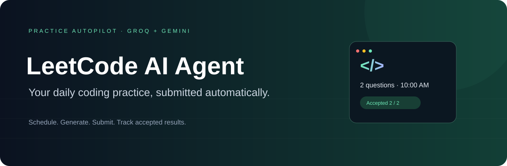
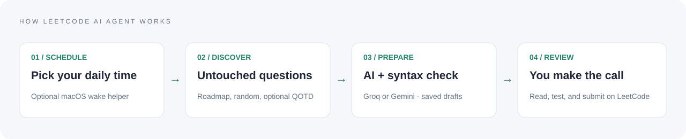
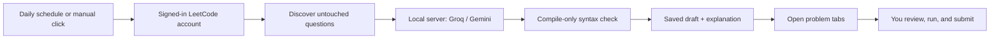

<div align="center">



# AlgoPilot ✨

**Build your coding habit. Let AI prepare the next practice session.**

[](https://nodejs.org/)
[](extension/manifest.json)
[](#ai-provider-setup)
[](LICENSE)

Scheduled LeetCode practice drafts · Manual batches · Review-first workflow · macOS wake scheduling

[Quick start](#quick-start) · [Features](#features) · [Troubleshooting](#troubleshooting) · [Contributing](CONTRIBUTING.md)

</div>

---

AlgoPilot is a local AI practice assistant with a Brave/Chrome extension. Choose a time and a question count: it discovers untouched LeetCode problems, prepares solution drafts with **Groq or Gemini**, checks their syntax, saves explanations, and opens the problems for review.

**You review, test, and submit the solution yourself.** AlgoPilot does not automatically submit to LeetCode or solve live rated contests. Draft preparation does not increase your official LeetCode streak.

> **Project status: experimental.** This is an unpacked extension, not a Chrome Web Store release. LeetCode session APIs and provider model availability can change. Syntax checks do not prove solution correctness. Live API generation depends on your account access, quota, and provider uptime.

## How it works



The visuals above are illustrations of the workflow, not screenshots or evidence of successful submissions.



## Features

| Feature | What you get |
|---|---|
| ⏰ Daily scheduling | Your time and timezone; default 10:00 AM Asia/Kolkata |
| 🎯 Adjustable targets | Automatic daily count: 1–10; manual batch: 1–100 |
| 🧭 Problem discovery | Foundations-to-advanced roadmap, then random eligible problems |
| 📅 Optional QOTD | Prefer the daily challenge when untouched and within your difficulty filter |
| 👤 Account flexibility | Uses the account signed in to the Brave/Chrome profile; optional username lock |
| 🤖 Two AI providers | Groq and Gemini, editable model IDs, configurable fallback order |
| 📝 Draft history | Generated code, explanation, complexity, attempt counts, and failure feedback |
| 🔎 Syntax validation | Python compile-only parsing and JavaScript `node --check`; code is not executed |
| 🛑 Stop control | Cancels the preparation session and preserves already prepared drafts |
| 🗓️ Contest calendar | Next seven days, official start times, reminders, and automatic contest-page opening |
| 🌙 macOS wake helper | Wake five minutes before practice or a listed contest; persistent background setup |
| 🔐 Local key storage | Provider keys encrypted on the server; extension stores the connection token |
| 💸 Budget controls | Daily token budget and up to eight generation attempts per question |
| 🧪 Owned test sandbox | Optional Docker judge and adapter for your own question/contest platform |

The live contest calendar refreshes every six hours in the extension; the installed macOS helper checks the official calendar hourly. The rolling practice plan refreshes each Monday.

## Quick start

### 1. Get the project

Requirements:

- **Node.js 22+** and npm.
- **Brave or Chrome**, with LeetCode signed in.
- At least one working **Groq or Gemini API key** and a model available to your account.
- **Python 3** for Python draft syntax checking. JavaScript checks use Node.js.
- Docker only if you want the optional owned test sandbox; it is not required for live draft preparation.

```bash
git clone https://github.com/kvianAR/algopilot.git
cd algopilot
npm start
```

There are no npm dependencies to install. The local server listens on `http://localhost:8787` by default.

In another terminal, from the same folder:

```bash
npm run token
```

Keep this connection token private.

### 2. Load the extension

1. Open `brave://extensions` or `chrome://extensions`.
2. Enable **Developer mode**.
3. Select **Load unpacked** and choose this repository's `extension/` folder.
4. Open **AlgoPilot** from the browser toolbar.
5. Enter `http://localhost:8787` and the connection token.
6. Keep LeetCode signed in in the same browser profile.

The localhost dashboard is useful for settings, but the **extension dashboard** is required for discovering account-specific questions and opening review tabs.

### 3. Connect an AI provider

Open **Settings & keys**, enter the provider key and model ID, then select **Save** and **Test connection**.

### 4. Prepare a session

- **Manual:** enter the number of questions and click **Prepare N now**.
- **Automatic:** set the start time, timezone, and questions/day; enable automatic mode and save.
- Open a ready draft's **Draft solution & explanation**, review the code, and use **Open & review on LeetCode**.
- Paste your reviewed solution into LeetCode, run its tests, and submit when ready.

A successful connection test checks a small request. It does not guarantee a larger solution request will succeed.

## AI provider setup

| Provider | Key source | Default model in this repository |
|---|---|---|
| Groq | [Groq console](https://console.groq.com/keys) | `qwen/qwen3.8-27b` |
| Gemini | [Google AI Studio](https://aistudio.google.com/api-keys) | `gemini-3.8-flash` |

Model IDs are editable defaults, not a promise of access or uptime. Choose a model your account supports. Keys do not have a single fixed model attached to them: the application sends the selected model with each request.

Keys can also be supplied as environment variables:

```bash
export GROQ_API_KEY="your-groq-key"
export GEMINI_API_KEY="your-gemini-key"
npm start
```

A saved encrypted key takes priority over an environment variable. Deleting a saved key does not delete a key supplied through the environment.

## Scheduling and a sleeping Mac

**The extension needs a running browser and a signed-in LeetCode session.** A sleeping Mac cannot execute browser code until it wakes. A cloud copy of the server alone does not provide a remote logged-in browser.

For persistent local scheduling on macOS, run from the project folder:

```bash
npm run background:install
```

This installs the local server as a login service and the wake helper as a system service. macOS asks for your administrator password. Keep Brave open and your user logged in before sleep.

```bash
# Show service state and power events
npm run background:status

# Preview wake events without changing them
npm run wake:preview

# Stop/remove the background server and wake helper
npm run background:uninstall
```

The helper watches saved state changes and refreshes the daily wake schedule. It also refreshes contest wakes hourly. For a **15:50** practice time, the expected wake time is **15:45**.

For a sleep test, choose a time at least ten minutes ahead, save it, check status, and then put the Mac to sleep. Hardware, closed-lid behavior, battery state, and macOS may affect scheduled waking. This is not guaranteed powered-off execution.

Wake-only controls are also available:

```bash
npm run wake:install
npm run wake:uninstall
```

**Power-setting caveat:** the current helper uses macOS's shared repeating wake schedule. Installing it replaces that repeating wake schedule; uninstalling clears it. Do not use it alongside another tool that manages repeating power events without reviewing this behavior. Contest events have their own AlgoPilot service identifiers.

A same-day stopped/failed automatic run can be archived and retried when moved to a later schedule. A prepared session remains terminal for that date. Manual sessions have their own history entries.

## Settings

| Setting | Range / behavior |
|---|---|
| Start time | `HH:MM`, interpreted in the chosen IANA timezone |
| Questions/day | 1–10 drafts |
| Manual count | 1–100 drafts; actual availability depends on untouched eligible questions |
| Difficulties | Any combination of Easy, Medium, Hard |
| Prefer QOTD | Optional; the challenge must be untouched and eligible |
| Max attempts | 1–8 per question |
| Provider order | Groq → Gemini or Gemini → Groq |
| Token budget | 1,000–1,000,000 estimated/reported tokens per day |
| Language | Python or JavaScript |
| Account lock | Off by default; enable only if you want the configured username |

`config.json` contains installation defaults. Saved dashboard settings are preserved across restarts and code updates; changing defaults does not overwrite existing saved settings. To change an existing installation, use the dashboard.

## Troubleshooting

| Symptom | Check / fix |
|---|---|
| `No working Groq or Gemini API key` | Read provider cards and notifications for the actual quota, model, key, or connection error. Reconnect after correcting it. |
| Connection passes but drafts fail | Larger requests may hit a different quota or limit. Test an actual draft; inspect its feedback. |
| Gemini returns 404 | Check model access and ID for your account. A listed model may still reject generation. |
| Provider temporarily unavailable | Try later or configure the other provider. Retries are bounded. |
| Wrong LeetCode account | Uncheck the account-lock setting, or sign in to the configured account in the same browser profile. |
| Time saves but session does not start | Keep the local server and browser running. Check Auto Mode, today's run status, and the timezone. |
| `Could not update the daily schedule` | Reload the extension itself and reopen its dashboard; old background code can mismatch new dashboard code. |
| Old `Solve` button appears | Click the extension card's Reload button; reopen the toolbar dashboard. Current drafts use **Prepare**. |
| `Local syntax check unavailable` | Install Python 3 for Python drafts; ensure it is available to the background service. Review any unchecked draft carefully. |
| Wake schedule is wrong | Run `npm run background:status`; match the Mac and configured timezone. |
| `Agent connection unavailable` | Check `http://localhost:8787/health`, service status, server URL, and connection token. |

Updating an unpacked extension requires **Reload on its extension card**. Refreshing a dashboard tab alone does not reload the background worker. After an update, reopen existing LeetCode tabs so content scripts also refresh.

Current limitation: local syntax checks do not run examples or hidden tests. A `ready` draft may be incorrect. API service health must be checked using your own account; automated tests use mocked provider responses.

## Development

```bash
npm test
```

The current suite includes **38 tests**, covering schedule handling, history, retries, key encryption, budgets, HTTP authorization, draft preparation, stop behavior, settings persistence, and real local syntax parsing. Automated tests do not make paid provider calls.

```text
algopilot/
├── extension/          # Manifest V3 dashboard, discovery, background worker
├── server/             # Local API, encrypted storage, providers, sandbox runner
├── scripts/            # Connection token and macOS install/status/wake helpers
├── test/               # Scheduling, provider, HTTP, draft and syntax checks
├── docs/assets/        # README visuals
├── config.json         # Fresh-install defaults
└── data/               # Runtime secrets and history (ignored by Git)
```

The live draft flow never sends a LeetCode submission request. The optional owned sandbox is a separate workflow with a private judge. Read the [owned platform API guide](docs/platform-api.md) if you want to connect your own question system.

For the owned Docker sandbox:

```bash
docker pull python:3.12-alpine
docker pull node:22-alpine
docker compose up -d --build
```

Set `leetcode.enabled` to `false` to use that sandbox workflow. Its generated code executes in restricted containers. The Compose configuration mounts the Docker socket; use it only on a machine you control. The Docker server image does not include Python 3 for live draft syntax checks; add it before using that feature in Docker.

## Data and privacy

- Groq/Gemini keys are encrypted with AES-256-GCM in local `data/state.json`.
- The vault key and encrypted state live on the same machine; encryption is not protection against someone with full machine access.
- The extension keeps a private connection token plus its local run history.
- Problem statements and feedback are sent to the selected AI provider.
- `data/`, environment files, keys, logs, and machine-specific launch files are excluded from Git.
- Token usage is an estimate or provider report; it is not your remaining account balance.
- Contest automation supplies calendar reminders and page opening only.
- This project is independent and is not affiliated with LeetCode, Groq, or Google.

## Contributing

Bug reports, documentation improvements, and patches are welcome. See [CONTRIBUTING.md](CONTRIBUTING.md). Never include API keys, connection tokens, cookies, or private runtime state in an issue.

If AlgoPilot helps your practice routine, a ⭐ or a shared walkthrough helps others discover it.

## License

[MIT](LICENSE) © 2026 AlgoPilot contributors.
